# AI-Enabled-FinTech-B2B-Order-Management-Application_MINOR

```
This project was submitted as a minor project in partial fulfillment of the requirements for the award of the Degree of Bachelor of Technology in Discipline of Engineering
```

Project Link (Access Restricted due to Copyright) -
```
https://drive.google.com/drive/folders/1Pltcfe59NWAiXx4Ggpn0gYy9eUGQqbYV?usp=sharing
```

https://user-images.githubusercontent.com/46164852/135722773-da373fe1-ee84-4f88-8600-0d7c311ba1ef.mp4


<div align="center">
  <a href="https://youtu.be/ADMaU7DLlt0">Watch it on Youtube</a>
</div>

## Abstract
The B2B world operates differently from the B2C or C2C world. Businesses work with other businesses on credit. When a buyer business orders something from the seller business, the seller business issues an invoice for that order. This invoice contains various information like the details of the goods purchased and when they should be paid.<br/>
Seller business interacts with various businesses and sells goods to all of them at various times. Hence, the seller business needs to keep track of the total amount it owes from all the buyers. This involves keeping track of all invoices from all the buyers. The buyer business needs to clear its amount due before the due date.<br/>
However, in real-world scenarios, the invoices are not always cleared i.e. paid in full amount by the due date.<br/>
The problem is to create an application for managing B2B order invoices. We have to build a Machine Learning Model to predict the payment date of an invoice when it gets created in the system and categorize the invoice into different buckets based on the predicted payment date, and this whole process should be managed by a beautiful UI.<br/>
In this given project we were required to make a full-stack Order Management application backed by a Machine Learning Model to predict the date of payment and ageing bucket of an invoice.<br/>
So my project i.e. “AI-enabled FinTech B2B Order Management System” should help the Account Receivables team by collecting payments from customers for their past dues, sending reminders and follow-ups to the customers for payments to be made, and help the company get paid for the services and products supplied.<br/>

### OVERVIEW
In this given project we were required to make a full-stack Order Management application backed by a Machine Learning Model to predict the date of payment and aging bucket of an invoice.
### PROBLEM DEFINITION
The problem is to create an application for managing B2B order invoices. We have to build a Machine Learning Model to predict the payment date of an invoice when it gets created in the system and categorize the invoice into different buckets based on the predicted payment date, and this whole process should be managed by a beautiful UI.
### PURPOSE  
In real-world scenarios, the invoices are not always cleared i.e. paid in full amount by the due date. So the purpose of my project is to help the Account Receivables team by collecting payments from customers for their past dues, sending reminders and follow-ups to the customers for payments to be made, and help the company get paid for the services and products supplied
### SCOPE  
This includes making an ML model, then making a beautiful UI, so that we could add, edit, delete records from the database, and with the help of the ML model, we can predict the payment date.

### THE IDEA BEHIND THE PROJECT
In the Machine Learning part of the project, we received an invoices dataset that contained the past payment information and behavior of various buyers. Based on the previous payment patterns, the ML model had to predict what will be the date payment is made by the customer for an invoice. The model also predicts which aging bucket the invoice falls into based on the predicted payment date. In the Web Development part, we parsed, processed, and loaded the given invoices dataset in the provided database schemas. A responsive UI is made which can display the invoice data loaded from the database. The UI supports searching and infinite scrolling operations. The UI supports editing of some editable fields, adding a new row to the grid, deleting rows from the grid, and downloading selected records from the grid in the predefined template(s).

## Project Implementation
### ML - DATA ANALYSIS & MODELLING
In this project, we ask two questions about a new business invoice when giving instances of historical invoices and outcomes: " Would the invoice payment delay or not? " If it would delay, how long the delay would be? To answer these two questions, we will invoice payment delay, build a regression model that predicts the number of days by which it will get delayed, based on a training set of data containing instances whose outcome is known. We formulate the invoice outcome prediction task as a supervised learning problem: given instances of past invoices and their outcomes, build a model that can predict when a newly issued invoice will be paid, if no advanced actions are taken. And this model shall help us understand the characteristics of delayed invoices and problematic customers. In other words, it doesn't not only identify the payment delay but also evaluates the customers.<br/>
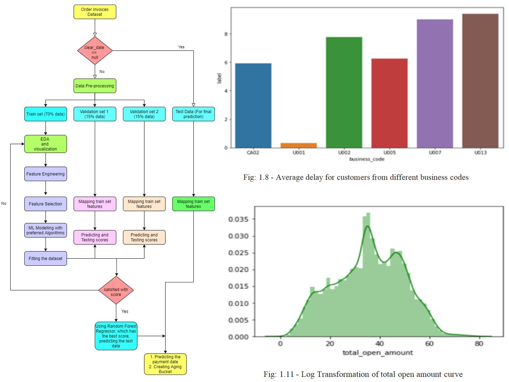<br/>
 - The dataset consisted of 50,000 rows, from which 4094 rows did not have the attribute ‘clear_date’. These observations (samples) are considered in the testing set. The other portion of the dataset is divided into training and two validation sets. All the date-related attributes are converted to DateTime format. The supervising attribute or the target variable is named ‘label’, which interprets the number of days of invoice payment delay. It is calculated by subtracting the due_in_date from the clear_date in terms of days. The training set consisted of 32134 observation data and the two validation sets have consisted of 6886 observations each.
 - The upper right barplot identified the average delay for customers from different business codes. Here we can see the customers from business code U001, make the minimum delay, and the customers from U013 make the maximum delay. 
 - From the lower right plot, we can observe the distribution of the total open amount curve on log transformation.
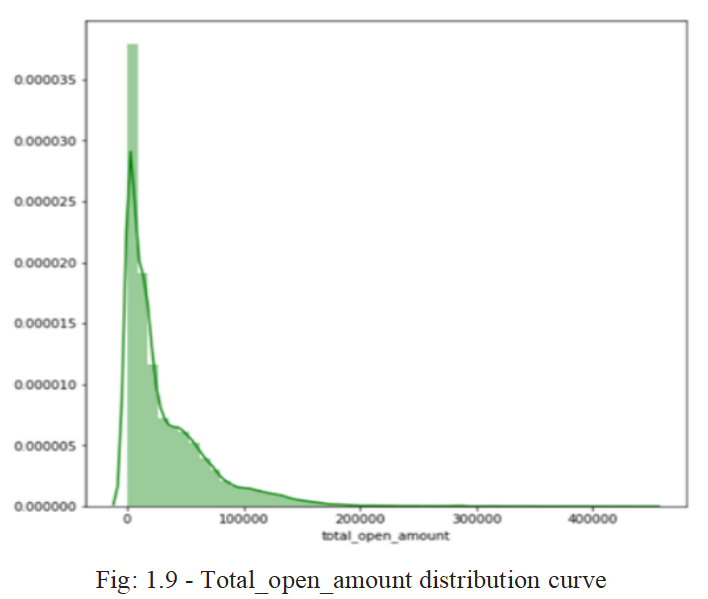&emsp;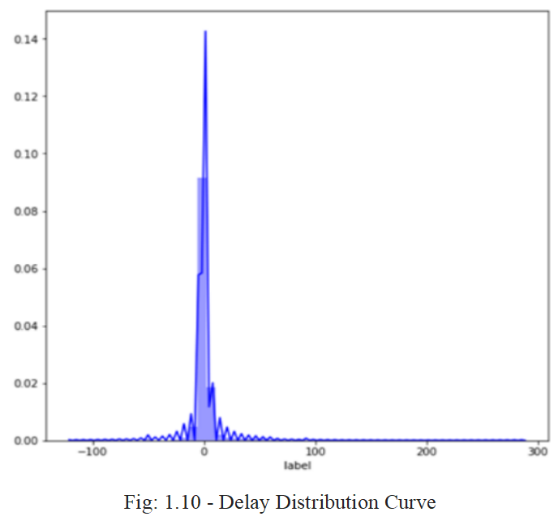<br/>
- From the first plot, we can observe that most of the open amount is in between 0-100,000 i.e. very less number of customers are there whose high amounts are pending.
- From the second curve, we can observe, most of the customers delay for a period mostly between 0-50.

## Result

| | Train Score  | Val1 Score    | Val2 Score     | mse            | model                   |
|-| :----------: | :-----------: | :------------: | :------------: | ----------------------: |
|1| 0.613453     | 0.472818      | 0.645630       | 34.657654      | XGBoost                 |
|2| 0.582278     | 0.570999      | 0.738099       | 25.614128      | Decision Tree           |
|3| 0.679106     | 0.546105      | 0.718473       | 27.533574      | Light Gradient Boosting |
|4| 0.637799     | 0.500607      | 0.659822       | 33.269671      | Gradient Boosting       |
|5| 0.936800     | 0.751315      | 0.722642       | 27.125892      | Random Forest           |

<div align="center">
  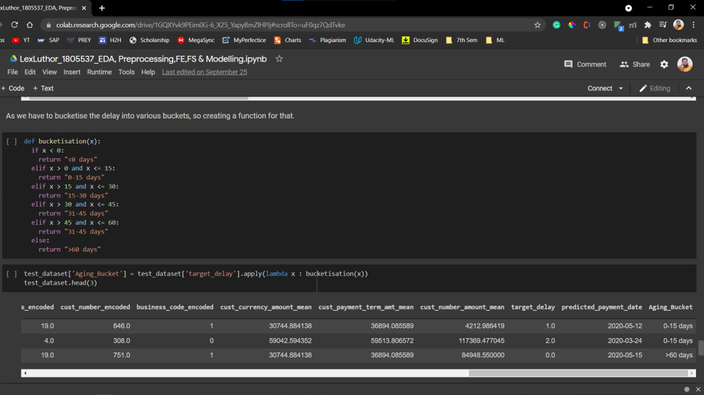<br/>
  <p>Fig: Bucketization</p>
</div>

### SQL + JAVA + REACTJS - APPLICATION DEVELOPMENT
The application development part is related to building a web-based application that consists of a frontend dashboard displaying the data in a tabular form with different options like add, delete, edit and predict, connected to a backend database. We have created a beautiful user interface to add, edit, delete, print, and most importantly, predict order invoices with ReactJS. For this we have followed certain steps :
- <b>Loading of Data in the Database</b>
  - The data was loaded in the database using SQLYOG and all tables and queries were created and successfully displayed. This was done by creating a raw CSV reader module from scratch. This module can read CSV files and can process the data to input into the database with the help of the JDBC Driver class.

<div align="center">
  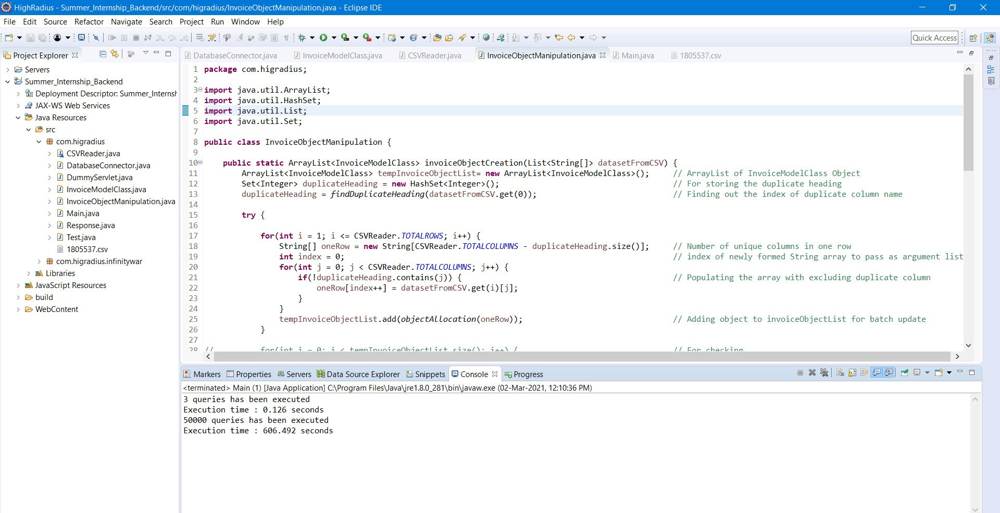<br/>
  <p>Fig: Java for Data Storing</p>
</div>

<div align="center">
  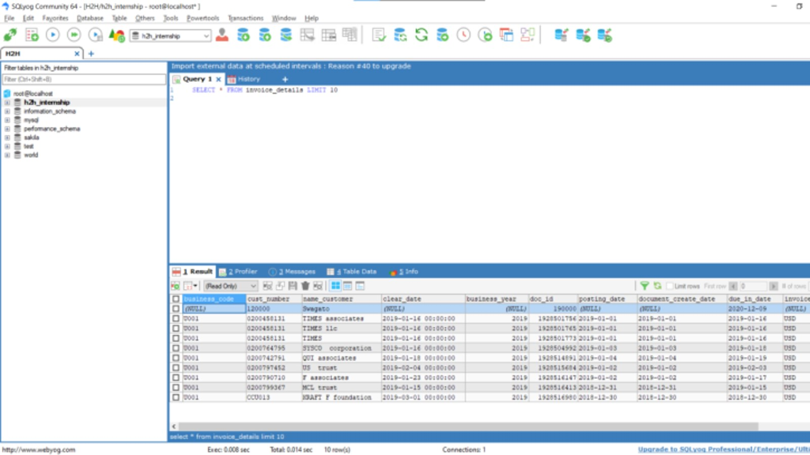<br/>
  <p>Fig: Data Inserted into SQLyog</p>
</div>

- <b>Creation of the Backend</b>
  - The backend portion was done in Java. The first JDBC connection was established with SQL. Then servlets were created for every functionality.
    - Add servlet - POST request from the frontend with parameters such as invoice amount, notes, date, etc and pass them to the SQL database to add a new order to the database
    - Edit Servlet - POST request from the frontend with parameters such as doc_id to identify the invoice in addition to the parameters which need to be changed.
    - Delete Servlet - Delete the selected invoices from the database, by passing their respective doc_id’s to identify them in the database.
    - Search Servlet - Get the invoice number from the frontend and pass them as an HTTP request and search through the database and return it to the frontend again.
    - Data Display Servlet - Display the table of invoices to the frontend UI.

<div align="center">
  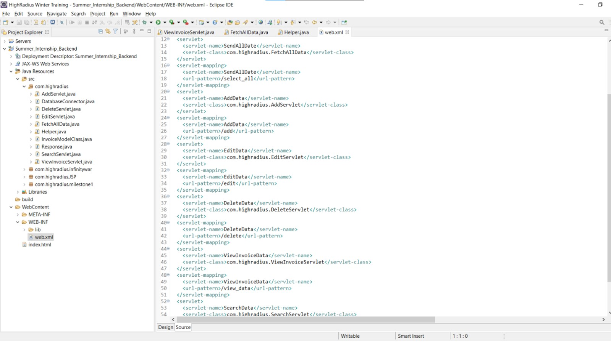<br/>
  <p>Fig: Java Servlets</p>
</div>

- <b>Creating a Responsive Dashboard</b>
  - A responsive dashboard was made in React Js. The main page had a Head Section, comprised of the company logo and account name logo, and then the Grid Section, comprised of a panel having Add, Delete, Edit, and search button. The Predicted Payment Date will remain blank and selecting one or multiple rows and then clicking on predict will get the payment date populated. Whenever multiple rows are selected the add button will remain activated and the user can type in the value he/she wants to insert. Also, the user has to fill all the required fields otherwise insertion won’t happen. Clicking on the edit button permits the user to edit all the editable columns, but only when one row is selected. With the help of the delete button, the user can delete one or more pre-existing data. The search button helps to look for particular data. View Correspondence button will help to print the invoices of one or more orders. All these functionalities were carried out by using material-UI and establishing a connection with the backend.

<div align="center">
  <br/>
  <p>Fig: Main UI</p>
</div>
The main UI page consists of the HighRadius logo in the upper middle, the company logo in the upper left corner, and the required buttons in the next subsequent portion and at last, the table UI which contains the dataset.
<div align="center">
  <br/>
  <p>Fig: Active Buttons</p>
</div>
<div align="center">
  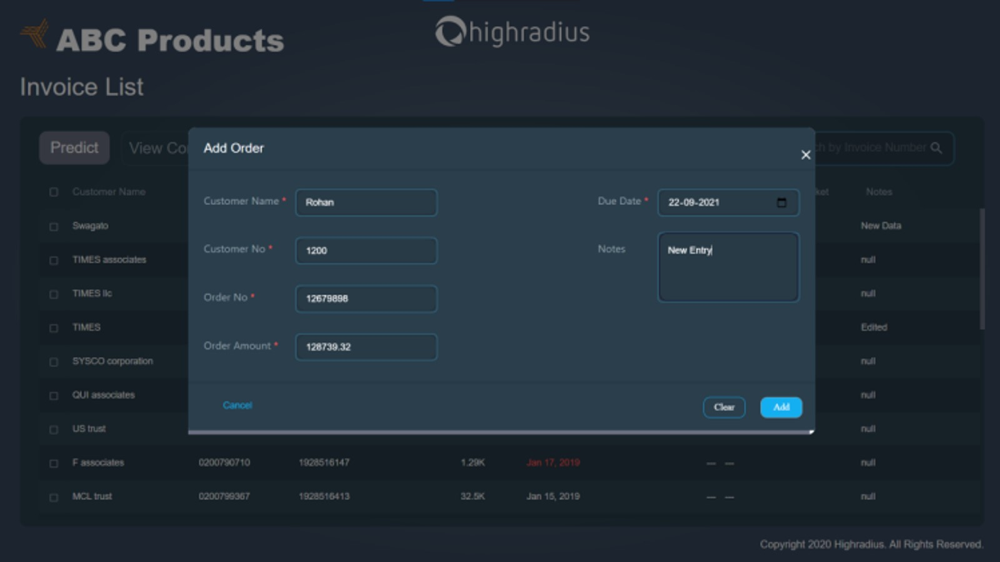<br/>
  <p>Fig: Add Button</p>
</div>
<div align="center">
  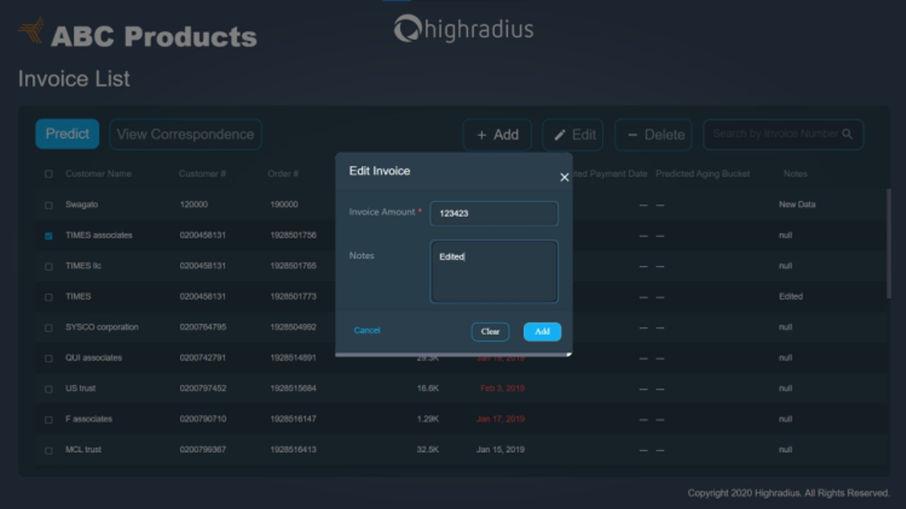<br/>
  <p>Fig: Edit Button</p>
</div>
<div align="center">
  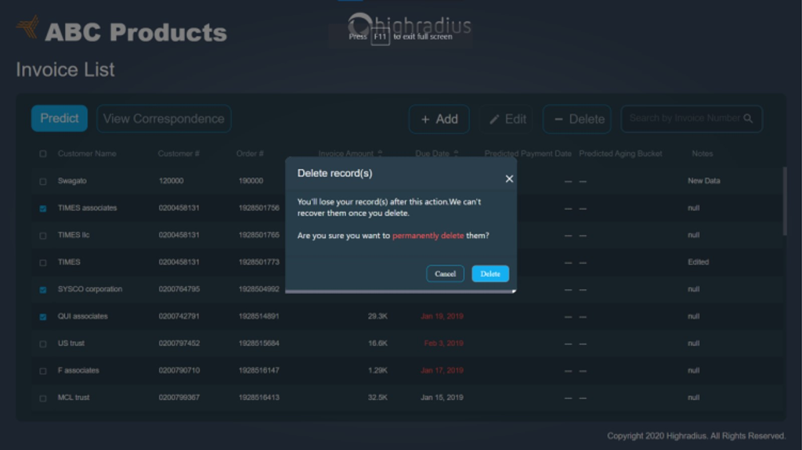<br/>
  <p>Fig: Delete Button</p>
</div>
<div align="center">
  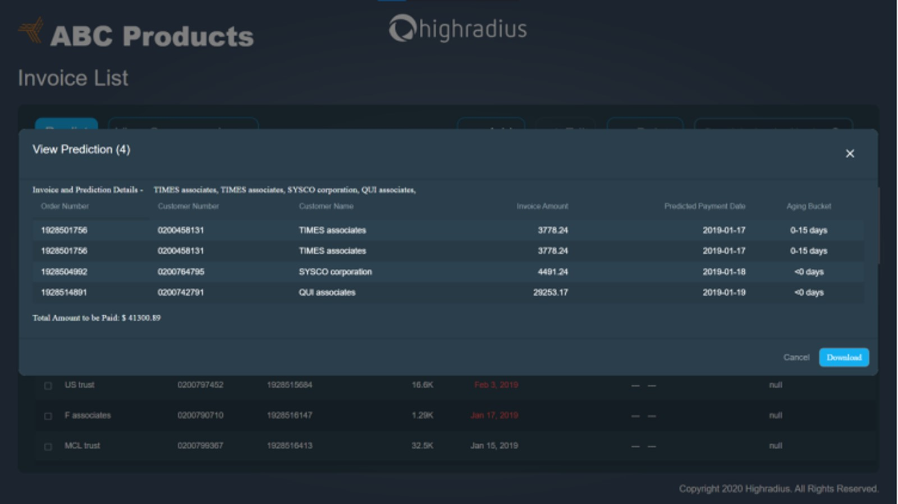<br/>
  <p>Fig: Predict Button</p>
</div>

### Flask Integration
Finally, integration of the ML model was done with help of the flask module. First, one .pickle file was generated then using some lines of python script flask integration was done. As same as the servlet used as an API for the functionalities, for the prediction also some POST request was made using this .pickle file. And finally, the project is complete.

<div align="center">
  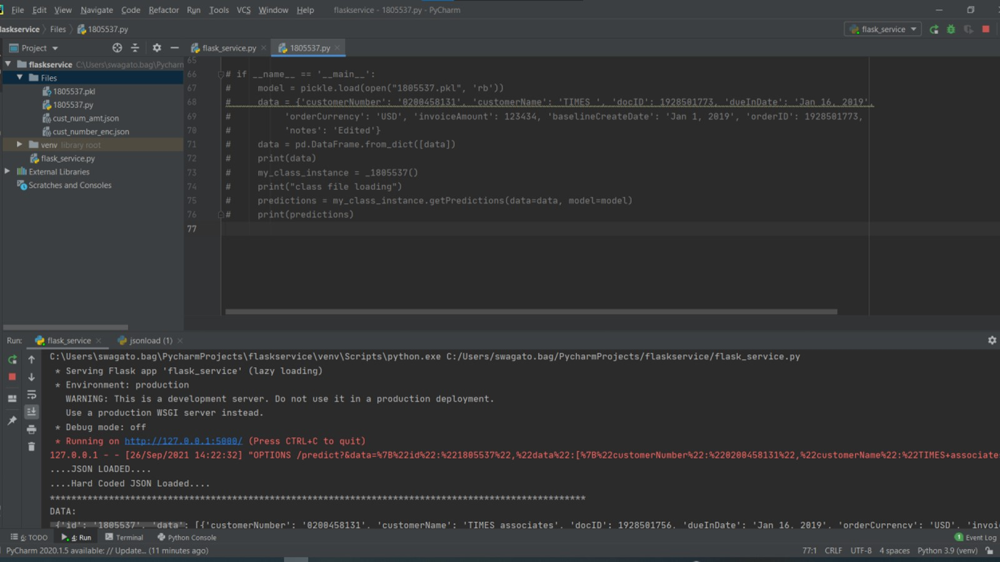<br/>
  <p>Fig: Working of Flask Server</p>
</div>

## Conclusion
During the tenure of my training at HighRadius, I had exposure to various technical languages which helped in shaping my analytical and problem-solving skills as well as provide knowledge that could be applicable in real-time projects as well. By making the Order Management System I was able to learn how a flow of code works and how to establish connections between different languages.
<div align="center">
  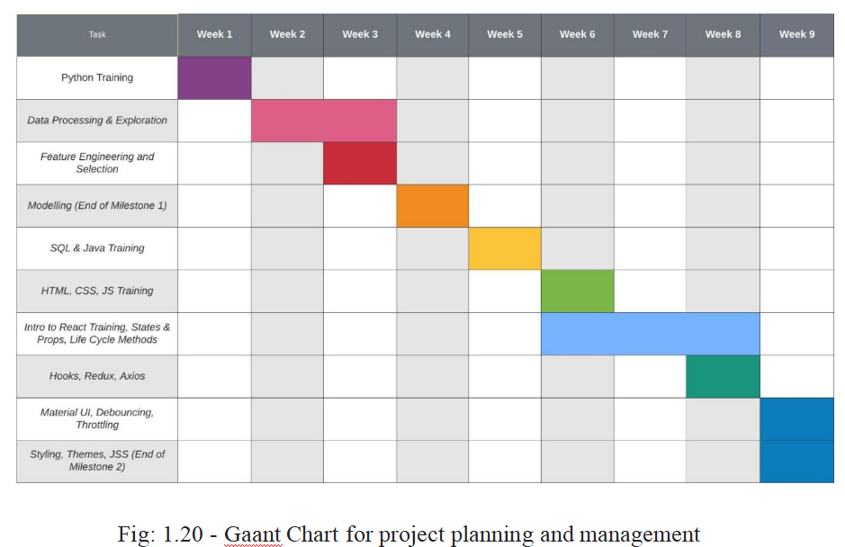<br/>
</div>

## Future Work
With the help of AI-Enabled Fintech B2B Order Management Application the organizations, companies, and in fact, individuals can keep track of the payment of their orders irrespective of a large number of clients. This will not only reduce time but also provide a functional manner for the proper functioning of an organization and/or workplace.
